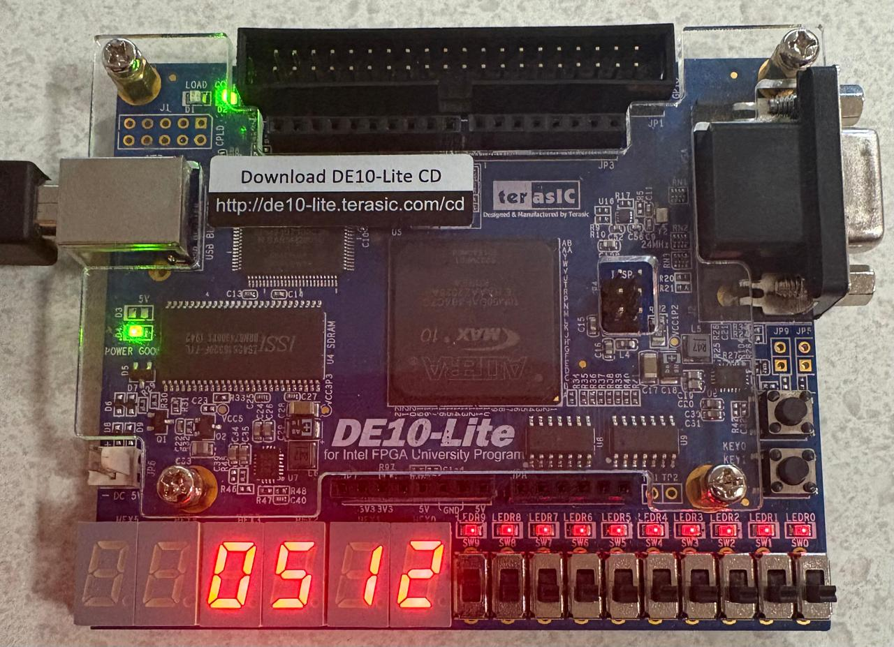

# Practica 1: Conversión de Binario a Decimal (BCD)

## Decodificación de Switches a Display en FPGA DE10-Lite

Este proyecto implementa un sistema en Verilog que lee el valor de los switches de la FPGA DE10-Lite, interpreta su valor como un número binario y lo muestra en formato decimal en los displays de 7 segmentos.

## Materiales Necesarios

- Tarjeta FPGA DE10-Lite
- Cable USB Blaster para la programación
- Software Intel Quartus Prime Lite
- Código en Verilog

## Descripción del Funcionamiento

- Los 10 switches de la FPGA representan un número en binario.
- El valor ingresado en los switches se convierte a decimal.
- Se muestra el número decimal en los displays de 7 segmentos.

## Desarrollo de la Práctica

### 1. Definición de Entradas y Salidas

Definir los switches como entradas y los displays de 7 segmentos como salidas en el código Verilog.

### 2. Conversión de Binario a Decimal

Implementar un módulo que convierta el valor binario de los switches a formato decimal para su visualización.

### 3. Decodificación y Visualización

Utilizar una decodificadora para mapear los valores decimales a los segmentos adecuados en el display de 7 segmentos.

### 4. Integración y Pruebas

Cargar el código en la FPGA, probar su funcionamiento y realizar ajustes si es necesario.

## Imagen de la FPGA

